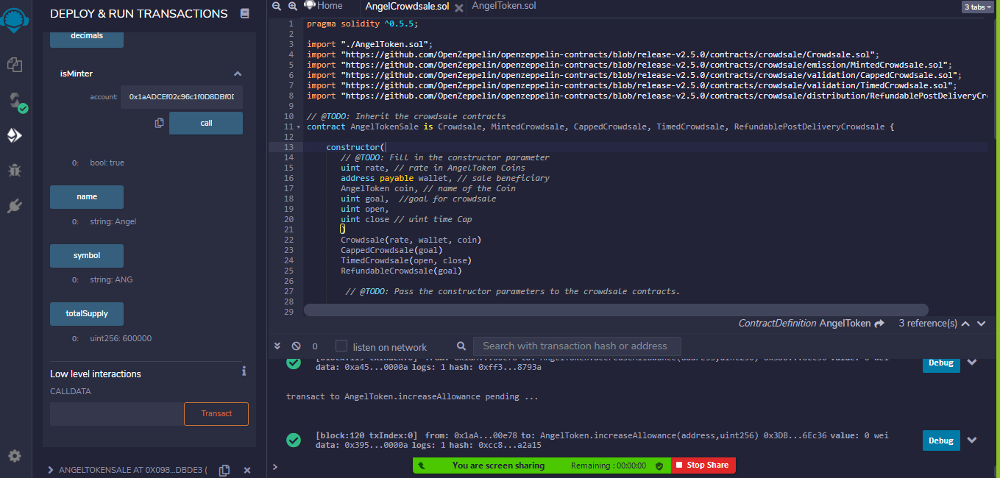
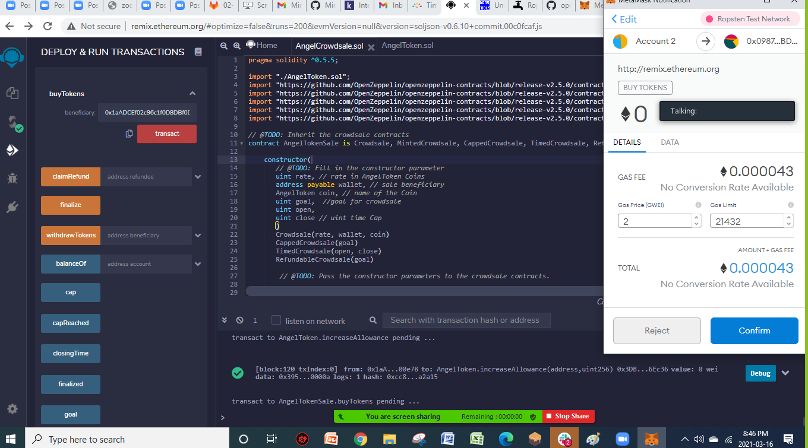

# Crowdsale contract - Angel Company

## Using blockchain technology to issue company Fungible Token

### Team Members: Syed Naqvi, Minh Tran, Rodrigo Guazzelli, Hsuan Liu, Abdullah Mamun

*The project is for study propose only*

---

## Project Presentation

### Summary

1. Overview

2. Sources

3. Blockchain technology

4. Approach

5. Technical Standards

6. Meaning

7. Room for Improvement

---

1. Overview

	It is hard to raise funds for private companies in the primary market. We are going to tokenize the enterprise value/ asset value using the proper ERC 20 standard to sell the FT.

	Any company can issue the token to raise funds on our platform. We are not assessing the company but selling the route people can raise fund.

	Target: institutional angel investors and aggressive retail investors who are interested in this fund-raising process

2. Sources

	[OpenZeppelin](https://docs.openzeppelin.com/contracts/2.x/api/crowdsale) n/
	[Ethereum.org](https://ethereum.org/en/learn/)n/
	[Fungibility](https://www.investopedia.com/terms/f/fungibility.asp)n/

3. Blockchain technology
    
    Solidity, Ganache, MetaMask, OpenZepplin, SafeMath, ERC20

4. Approach

    * Define variables: Company’s name/ Name of the client/ coin name/ time/ refundable policy

    * Mint Function: Max token issuance

    * Customize Crowdsale rate

    * Time: selling period

5. Technical Standards Protocols

    5.1. ERC-20 

    It is used for all smart contracts on the Ethereum blockchain for token implementation and provides a list of rules that all Ethereum-based tokens must follow. ERC-20 is similar, in some respects, to bitcoin, Litecoin, and any other cryptocurrency; ERC-20 tokens are blockchain-based assets that have value and can be sent and received. ERC-20 tokens are issued on the Ethereum network instead of running on their own blockchain.

    ERC-20 is the base implementation of the ERC20 interface.

    5.2. ERC20Detailed

    It is the contact used to establish the values for `name`, `symbol`, and `decimals`. All three values are immutable: they can only be set once during construction.

    5.3. ERC20Mintable

    Extension of ERC20 that sets the accounts with the MinterRole, which have permission to mint (create) new tokens as they see fit.

    For our project, only the owner is allowed to mint tokens.

    5.4. Crowdsale

    Crowdsale is a base contract for managing a token crowdsale. A cryptocurrency crowdsale is a method of funding a project through the sale of tokens, which the investor can buy it with ether. This contract can be customized to provide additional functionality. *It is not intended to be modified / overridden after the customization.*  

    These tokens are digital strings of code that allow for participation in the project. 

    Crowdsales are not regulated by the U.S. Securities and Exchange Commission.

    5.5. MintedCrowdsale

    Extension of Crowdsale contract which allows the token to be minted. Token ownership should be transferred to MintedCrowdsale for minting.

    5.6. CappedCrowdsale

    Crowdsale with a limit for total contributions.

    5.7. TimedCrowdsale

    Crowdsale accepting contributions only within a time frame.

    5.8. RefundablePostDeliveryCrowdsale

    Extension of RefundableCrowdsale contract that only delivers the tokens once the crowdsale has closed and the goal met, preventing refunds to be issued to token holders.

    For our project, refunds will not be issued.

6. Meaning - Crowdsale

    Crowdsale contract allows companies to use their Equity as collateral, it is called Equity Crowdfunding.

    Through it, individuals can invest early (don’t need to wait for company’s IPO) for a share in equity. It allows anyone the chance to invest.
 
    As with other types of equity-based funding, for investors to make any money, they require an eventual exit: selling their shares in the event of a merger, acquisition or even IPO. But always be aware of any potential frauds. As investor, we must do our own due diligence for any company, listed on the stock exchange or not. Numbers, orders, or “news” about the company can be invented so if you decided to look for a Crowdsale know that you’re on your own. A good way to start, is knowing the business, the product, the industry and the board of directors and your way of management. 

    But you have a long way to go, remember that it always risk dealing with investment.

7. Room for Improvement

* Adding:
	1. Function to converting time -- Unix Timestamp conversion tools 

	2. Validate the business operation 
	
	3. Fraud Detection: Improve methodology to discover potential fraud

